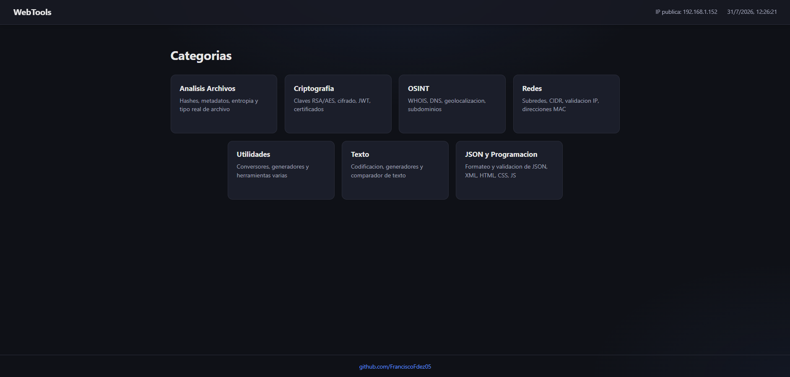

# WebsTools

---

Navaja suiza web para ciberseguridad y administracion de sistemas: **63 herramientas** de
analisis de archivos, criptografia, OSINT, redes, texto y utilidades, reunidas en una sola
interfaz. Se despliega con un unico comando en un servidor de la red local y queda accesible
desde el navegador de cualquier dispositivo de la LAN — sin instalar nada en los clientes.



## ✨ Características ✨

---

### 📁 Analisis de Archivos (10)

| Herramienta | Descripcion |
| --- | --- |
| Generar Hashes | Calcula MD5, SHA1, SHA256 y SHA512 de un archivo |
| Verificar Hash | Comprueba si el hash de un archivo coincide con el esperado |
| Detectar Tipo Real | Detecta el tipo real de un archivo por su contenido, no por la extension |
| Calcular Entropia | Entropia de Shannon, para detectar cifrado o empaquetado |
| Ver Metadatos | Muestra los metadatos EXIF de una imagen o de un PDF |
| Eliminar Metadatos | Limpia los metadatos y descarga el archivo saneado |
| Editar Metadatos | Edita etiquetas EXIF de una imagen y descarga el resultado |
| Extraer Strings | Extrae cadenas imprimibles de un binario (equivalente a `strings`) |
| Visor de Base de Datos | Explora una SQLite: tablas, vistas, esquema y filas |
| Analizar Firma Digital | Comprueba la firma Authenticode de un ejecutable PE de Windows |

### 🔐 Criptografia (9)

| Herramienta | Descripcion |
| --- | --- |
| Generar Claves RSA | Par de claves RSA privada/publica en formato PEM |
| Cifrar / Descifrar RSA | Cifrado asimetrico con OAEP-SHA256 |
| Generar Clave AES | Clave AES aleatoria en Base64 y Hex |
| Cifrar / Descifrar AES-GCM | Cifrado simetrico autenticado |
| Generar HMAC | HMAC de un texto con una clave secreta |
| JWT Inspector | Decodifica un JWT y valida su firma si se aporta la clave |
| Certificado Autofirmado | Certificado X.509 autofirmado junto a su clave privada |

### 🔎 OSINT (11)

| Herramienta | Descripcion |
| --- | --- |
| WHOIS | Datos de registro publico de un dominio |
| DNS Lookup / Reverse DNS | Consulta de registros DNS y resolucion inversa de una IP |
| DNS Propagation | Consulta el mismo registro contra varios resolvers publicos |
| Geolocalizacion IP | Ubicacion aproximada de una direccion IP |
| ASN Lookup | Sistema autonomo al que pertenece una IP |
| Comprobar SPF / DKIM / DMARC | Auditoria de los registros de correo de un dominio |
| Comprobar IP Cloudflare | Verifica si una IP esta en los rangos publicados por Cloudflare |
| Buscar Subdominios | Subdominios via Certificate Transparency (crt.sh) |

### 🌐 Redes (7)

| Herramienta | Descripcion |
| --- | --- |
| Conversor CIDR | Direccion de red, mascara y broadcast a partir de un CIDR |
| Calculadora de Subredes | Rango de hosts utilizables de una subred |
| Calculadora Wildcard | Mascara wildcard inversa de un CIDR |
| Validar IPv4/IPv6 | Comprueba validez y version de una IP |
| Conversor IP ↔ Decimal | IPv4 a su representacion decimal y viceversa |
| Conversor IPv4 ↔ IPv6 | IPv4 a IPv6 mapeada (`::ffff:a.b.c.d`) y viceversa |
| Generador de MAC | Direccion MAC unicast administrada localmente |

### 📝 Texto (8)

| Herramienta | Descripcion |
| --- | --- |
| Codificar / Decodificar | Base64, URL, HTML, Hex, Binario y ASCII |
| JWT Decoder | Cabecera y cuerpo de un JWT sin verificar la firma |
| Generador de Contrasenas | Longitud y conjuntos de caracteres configurables |
| Generador de Passphrase | Estilo diceware, con wordlist embebida |
| Fortaleza de Contrasena | Analisis con la libreria zxcvbn |
| Generador de UUID | UUID version 1 o version 4 |
| Comparador de Textos | Diff linea a linea entre dos textos |

### 🛠️ Utilidades (11)

| Herramienta | Descripcion |
| --- | --- |
| Descargador de Video/Audio | MP4 o MP3 desde YouTube, Twitter/X, TikTok y otras webs |
| Internet Downloader | Descarga desde una URL publica (solo http/https, IPs privadas bloqueadas) |
| QR Generator / QR Reader | Genera un QR como PNG y lee los QR de una imagen |
| Conversor Timestamp ↔ Fecha | Timestamp Unix a ISO 8601 y viceversa |
| Conversor Unix Time | Entre segundos y milisegundos Unix |
| Conversor de Unidades | Longitud, peso, datos y temperatura |
| Generador de Claves API | Clave aleatoria criptograficamente segura |
| Generador de Lorem Ipsum | Parrafos de texto de relleno |
| Generador de Nombres | Nombres y apellidos aleatorios |
| Generador de User-Agent | User-Agent real de una lista curada por navegador |

### 💻 JSON y Programacion (7)

| Herramienta | Descripcion |
| --- | --- |
| Formatear / Validar / Minificar JSON | Indenta, comprueba la validez y comprime un JSON |
| Beautify XML / HTML / CSS / JavaScript | Indenta y da formato legible al codigo |

### Ademas

- 🔒 **Rate limiting por IP** — 20 peticiones/minuto de forma global, 15 en OSINT y 6 en el
  descargador de video, para evitar abusos desde la red.
- 🐳 **Despliegue en un comando** — `./docker-up.sh` genera el `.env`, crea la `SECRET_KEY` y
  levanta el contenedor con todas las dependencias nativas ya incluidas.
- ⚙️ **Configuracion centralizada** — puerto, limites de subida y timeouts en un unico `config.ini`.
- 🔁 **Reinicio automatico** — el contenedor usa `restart: unless-stopped`, asi que sobrevive a
  reinicios del servidor.

## 🖥️ Requisitos

---

**Para el despliegue (recomendado):**

- Un servidor Linux en la LAN con **Docker** y el plugin **Docker Compose v2**
- **Python 3** en el host, unicamente para que `docker-up.sh` lea `config.ini` y genere la clave
- El puerto elegido (por defecto el `8500`) libre y abierto en el firewall

**Para ejecutarlo sin Docker (desarrollo):** Python 3.11+ y estas dependencias nativas, de las
que dependen varias herramientas:

| Paquete | Herramientas que lo necesitan |
| --- | --- |
| `libmagic1` | Deteccion de tipo real de archivo |
| `libzbar0` | Lectura de codigos QR |
| `libimage-exiftool-perl` | Ver, editar y eliminar metadatos de imagenes |
| `ffmpeg` | Conversion de video/audio del descargador multimedia |

```bash
sudo apt-get install libmagic1 libzbar0 libimage-exiftool-perl ffmpeg
```

> ⚠️ En **Windows** la app arranca pero muestra un aviso: esas cuatro dependencias no vienen de
> serie y las herramientas que las usan fallaran. Para funcionalidad completa, usa Linux o Docker.
> La imagen Docker ya las incluye todas.

## 📦 Guía de instalación ⚙️

---

### Opcion A — Docker (recomendada)

```bash
git clone https://github.com/FranciscoFdez05/WebsTools.git
cd WebsTools
chmod +x docker-up.sh    # solo la primera vez, si se perdio el bit de ejecucion
./docker-up.sh
```

`docker-up.sh` es el **unico punto de entrada**. En cada arranque:

1. Crea el `.env` a partir de `.env.example` con una `SECRET_KEY` aleatoria de 32 bytes (y la
   regenera si detecta que aun tiene el valor de ejemplo).
2. Lee el puerto de `config.ini` y lo exporta para que `docker-compose.yml` publique el mismo
   valor dentro y fuera del contenedor.
3. Construye la imagen y levanta el servicio en segundo plano.
4. Imprime la URL con la IP LAN del servidor.

> ❌ No ejecutes `docker compose up` directamente: sin las variables que exporta el script el
> arranque falla a proposito, para no levantar el servicio con una clave insegura o un puerto
> descoordinado.

### Opcion B — Local, sin Docker

```bash
git clone https://github.com/FranciscoFdez05/WebsTools.git
cd WebsTools
python3 -m venv .venv && source .venv/bin/activate
pip install -r requirements.txt
python app.py
```

## 📋 Guía de uso 🕹️

---

### Acceder desde otro dispositivo de la LAN

Abre en el navegador de cualquier movil, portatil o tablet de la misma red:

```
http://<ip-del-servidor>:<puerto>
```

Por ejemplo `http://192.168.1.50:8500`. La IP exacta te la imprime `docker-up.sh` al terminar.
No hay que instalar nada en el dispositivo cliente.

Si desde el servidor funciona pero desde otro equipo no, casi siempre es el firewall:

```bash
sudo ufw allow 8500/tcp
```

### Cambiar el puerto

Edita **solo** el valor `port` de la seccion `[server]` en `config.ini` y vuelve a lanzar el script:

```ini
[server]
host = 0.0.0.0
port = 8500
debug = false
```

```bash
./docker-up.sh
```

`config.ini` es la unica fuente del puerto — no lo definas a mano en `.env`, en
`docker-compose.yml` ni como variable de entorno suelta, o los valores se desincronizaran.

### Otros ajustes de `config.ini`

| Clave | Que hace |
| --- | --- |
| `[app] maxUploadMb` | Tamano maximo de los archivos que se pueden subir (32 MB por defecto) |
| `[osint] timeoutSegundos` | Timeout de las consultas WHOIS/DNS |
| `[osint] geolocalizacionUrl` | Servicio de geolocalizacion por IP |
| `[proxy] confiarXForwardedFor` | Usar `X-Forwarded-For` como IP real del cliente. Dejalo en `true` solo si hay un proxy inverso delante; si no, cualquiera podria falsear su IP y saltarse el rate limit |

### Gestion del contenedor

```bash
docker compose logs -f webtools    # ver los logs en vivo
docker compose restart webtools    # reiniciar
docker compose down                # parar y eliminar el contenedor
./docker-up.sh                     # reconstruir y levantar tras cambiar codigo o config
```

### Tests

```bash
pytest
```

## 🤝 Contribuciones 🤝

---

Las contribuciones son bienvenidas. Para proponer un cambio:

1. Haz un fork del repositorio y crea una rama descriptiva (`git checkout -b feature/mi-herramienta`).
2. Sigue las convenciones del proyecto: nombres en `camelCase`, codigo y comentarios en espanol
   sin tildes, y la logica de cada herramienta separada en `logic.py` de su ruta en `routes.py`.
3. Anade una herramienta nueva registrandola en el diccionario `TOOLS` de la categoria que le
   corresponda, dentro de [categories/](categories/).
4. Acompana el cambio con tests en [tests/](tests/) y comprueba que `pytest` pasa en verde.
5. Abre un Pull Request explicando que aporta el cambio.

Si encuentras un fallo o se te ocurre una herramienta util, abre un issue.

## 📜 Licencia

---

📄 Este proyecto está licenciado bajo la Licencia MIT. Consulta el archivo `LICENSE` para más detalles..

---

**Developed with ❤️ by [Francisco](https://github.com/FranciscoFdez05)**
